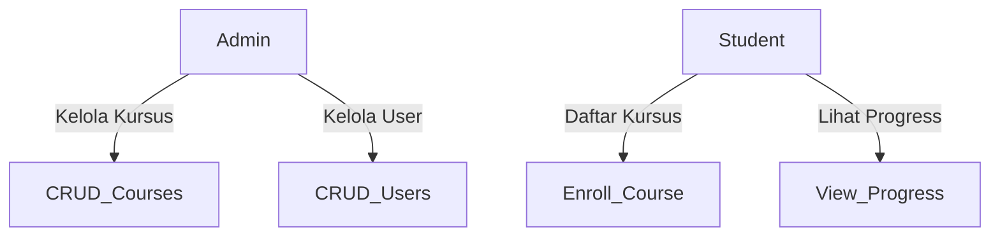

# **Tugas Project MK Web Lanjutan**  
**Sistem Manajemen Kursus (Course Management System)**  

**Anggota Kelompok:**  
1. [Nama Anggota 1]  
2. [Nama Anggota 2]  
3. [Nama Anggota 3]  
4. [Nama Anggota 4] (opsional)  

---

## **📝 Deskripsi Proyek**  
Aplikasi **Sistem Manajemen Kursus** dirancang untuk memudahkan pengelolaan materi pembelajaran, pendaftaran kursus, dan manajemen pengguna dengan dua role (**Admin** dan **Student**). Aplikasi ini dibangun menggunakan:  
- **Frontend:** React + Tailwind CSS (+ DaisyUI)  
- **Backend:** Flask (Python) + JWT Authentication  
- **Database:** PostgreSQL / SQLite  

---

## **🎯 Fitur Utama**  
### **Role: Admin**  
- ✅ Manajemen Kursus (CRUD)  
- ✅ Manajemen Pengguna (Student)  
- ✅ Melihat laporan pendaftaran kursus  

### **Role: Student**  
- ✅ Mendaftar & login  
- ✅ Melihat daftar kursus  
- ✅ Mendaftar ke kursus  
- ✅ Melihat progress pembelajaran  

---

## **📂 Struktur Proyek**  
```bash
course-management/
├── backend/             # Flask API
│   ├── app.py           # Main Flask app
│   ├── routes/          # API routes (auth, courses, users)
│   ├── models/          # Database models
│   ├── utils/           # JWT, error handlers
│   └── requirements.txt # Dependencies
├── frontend/            # React App
│   ├── src/
│   │   ├── components/  # UI Components
│   │   ├── pages/       # Role-based pages
│   │   ├── hooks/       # Custom hooks (API calls)
│   │   ├── context/     # Auth context
│   │   └── App.js       # Routing & protected routes
│   ├── tailwind.config.js
│   └── package.json
└── README.md
```

---

## **🔧 Setup & Instalasi**  
### **Backend (Flask)**
1. **Buat virtual environment & install dependencies:**  
   ```bash
   cd backend
   python -m venv venv
   source venv/bin/activate  # (Windows: venv\Scripts\activate)
   pip install -r requirements.txt
   ```

2. **Jalankan server:**  
   ```bash
   flask run --port 5000
   ```
   - API akan berjalan di `http://localhost:5000`  

### **Frontend (React)**
1. **Install dependencies:**  
   ```bash
   cd frontend
   npm install
   ```

2. **Jalankan development server:**  
   ```bash
   npm start
   ```
   - Aplikasi akan berjalan di `http://localhost:3000`  

---

## **🔐 Autentikasi & Role Management**  
- Menggunakan **JWT (JSON Web Token)** untuk login & role-based access.  
- **Protected Routes** di frontend menggunakan `react-router-dom`.  
- **Contoh endpoint auth:**  
  - `POST /api/auth/login` (Email & Password)  
  - `GET /api/auth/me` (Get user data from JWT)  

---

## **📊 Database (4+ Tabel)**  
| Tabel         | Deskripsi                          |
|--------------|----------------------------------|
| `users`      | Data pengguna (admin & student)   |
| `courses`    | Daftar kursus                     |
| `enrollments`| Pendaftaran kursus oleh student   |
| `progress`   | Progress belajar student          |

---

## **⚡ Fitur Teknis (Backend)**  
✅ **Modular Flask** (Blueprint untuk routes)  
✅ **CRUD API** (GET, POST, PUT, DELETE)  
✅ **JWT Authentication** (Role-based access)  
✅ **Error Handling** (404, 500, validasi input)  

---

## **🎨 Fitur Teknis (Frontend)**  
✅ **Tailwind CSS + DaisyUI** (Responsive UI)  
✅ **Protected Routes** (Berdasarkan role)  
✅ **Loading & Error Handling** (UX lebih baik)  
✅ **Mobile-Friendly Design**  

---

## **📌 Use Case Diagram**  


---

## **🚀 Deployment**  
### **1. Backend (Flask)**  
- **Render / Railway / Heroku**  
- Pastikan set environment variables (`JWT_SECRET`, `DATABASE_URL`).  

### **2. Frontend (React)**  
- **Vercel / Netlify**  
- Atur `API_BASE_URL` ke backend yang sudah di-deploy.  

---

## **📌 Referensi**  
- [React Router](https://reactrouter.com)  
- [Flask JWT Extended](https://flask-jwt-extended.readthedocs.io/)  
- [DaisyUI Docs](https://daisyui.com/)  

---

**© 2024 - MK Web Lanjutan - [Nama Universitas]**
